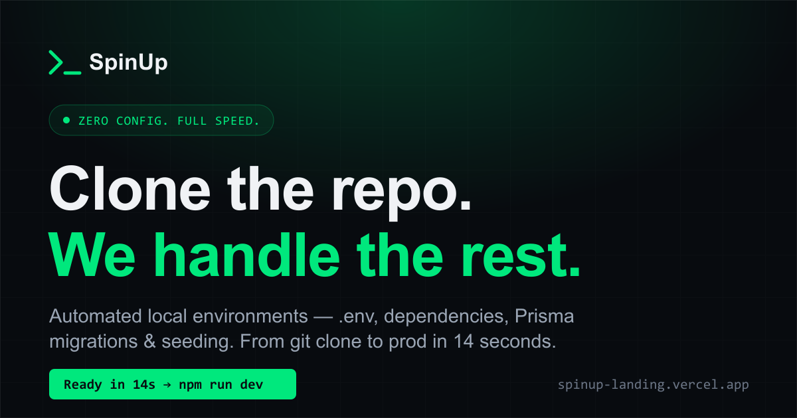

# SpinUp — Landing Page

> **Clone the repo. We handle the rest.**
> A concept landing page for a fictional B2B SaaS developer tool — written and built end to end as a spec/portfolio piece.

**🔗 Live site → [spinup-landing.vercel.app](https://spinup-landing.vercel.app/)**



---

## About this project

SpinUp is an imagined developer tool that automates local environment setup — `.env` configuration, dependency installs, Prisma migrations, and database seeding — turning a multi-day onboarding into a 14-second command.

The product doesn't exist. The point of the project is to demonstrate, in one cohesive piece, the two things I do:

- **Copywriting** — direct-response, B2B SaaS copy aimed at a technical audience (Lead Developers, Engineering Managers, CTOs). Punchy, logical, no marketing fluff. Built around a clear problem → agitation → solution → proof → CTA structure.
- **Frontend engineering** — a fast, fully responsive, dark-mode landing page built from scratch in React, with custom animations and a strict, self-imposed design system.

## My role

I designed the brand voice, wrote **100% of the copy**, defined the visual design system, and built the entire front end. Sole author.

## Highlights

- **Animated before/after terminal** — a split-screen demo that types out the painful manual setup vs. the one-command SpinUp flow, with a replay control.
- **Syntax-highlighted config block** with a working copy-to-clipboard button.
- **Scroll-reveal animations** that respect `prefers-reduced-motion`.
- **Custom social share card** (Open Graph) generated programmatically.
- **Strict design system** — hairline borders, a single accent color, two intentional glows, and zero gratuitous shadows or gradients.

## Tech stack

| | |
|---|---|
| Framework | React 19 + TypeScript |
| Build tool | Vite |
| Styling | Tailwind CSS v4 (with inline-styled typography for precise control) |
| Icons | lucide-react |
| Share-card generation | sharp (SVG → PNG) |
| Hosting | Vercel (auto-deploy on push) |

## Design system

- **Type:** Inter (UI / copy) + JetBrains Mono (code, terminals, labels, stats)
- **Palette:** near-black `#080B0F` canvas, `#00E87D` brand green, layered grays for hierarchy
- **Rules:** hairline `1px` borders, max `12px` radius on panels, color-only hover transitions, dark mode only — no light theme

## Run locally

```bash
git clone https://github.com/tudorsendrescu/spinup-landing.git
cd spinup-landing
npm install
npm run dev
```

Other scripts:

```bash
npm run build     # production build
npm run preview   # preview the production build locally
npm run og        # regenerate the social share card (public/og.png)
```

## Author

**Sendrescu Tudor** — Copywriter & Developer
[github.com/tudorsendrescu](https://github.com/tudorsendrescu)

---

*SpinUp is a fictional product created for portfolio purposes. It is not a real service and is not affiliated with any company.*
